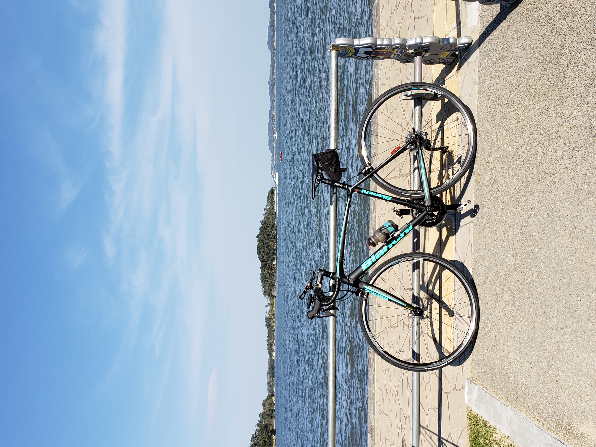

<!--
_class: lead
_color: white
-->


# 自己紹介

---
<!--
_class: lead
-->
# Self-Introduction

---
# 自己紹介

## miyuush（みゅー）



- 社会人歴：3年
- 仕事　　：SREよりのSWE
- 趣味　　：ロードバイク、猫、ゲーム

```yaml
interested:
  cloudNative:
    cicd:
      - GitHub Actions
      - GitLab CI/CD
    container:
      - Docker
      - Kubernetes
    iac: Terraform
  language:
    - Go
    - Python
```
